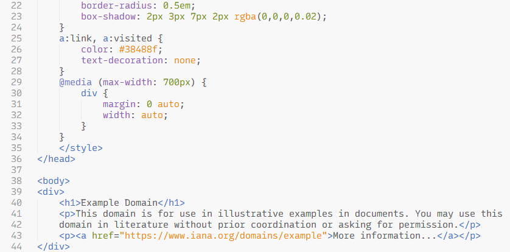
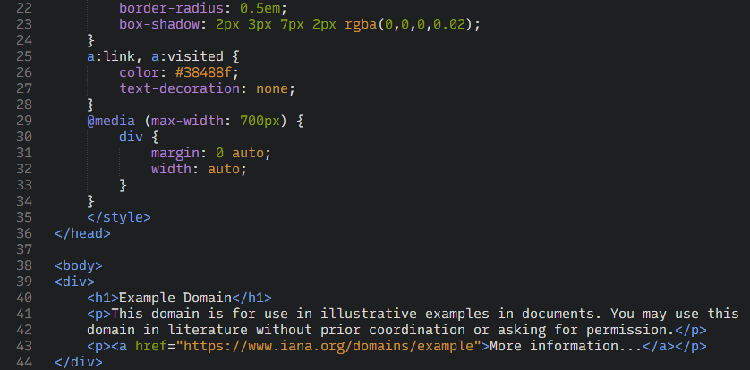

# Brackets Color Scheme

[](https://github.com/jwortmann/brackets-color-scheme/blob/master/LICENSE)
[](https://github.com/jwortmann/brackets-color-scheme/releases)
[](https://packagecontrol.io/packages/Brackets%20Color%20Scheme)

This package for Sublime Text provides two color schemes (light and dark) that are similar to the built-in themes of Adobe Brackets.

## Installation

The color scheme can be installed with Sublime Text's package manager [Package Control](https://packagecontrol.io/installation).
From the command palette select *Package Control: Install Package* and search for *Brackets Color Scheme*.

The color scheme can then be activated from the menu under *Preferences > Select Color Scheme...* or via the *UI: Select Color Scheme* command from the command palette.

## Preview





## Color palette

| Color variable | Brackets Light | Brackets Dark | Example usage |
| -------------- | -------------- | ------------- | ------------- |
| | `#f8f8f8` | `#1d1f21` | background |
| textcolor | `#535353` | `#dddddd` | plain text, variables, constants, operators, punctuations |
| grey | `#949494` | `#767676` | comments |
| blue | `#446fbd` | `#6c9ef8` | keywords, intrinsic/library functions and classes, tags |
| orange | `#e88501` | `#d89333` | strings, built-in constants, arguments in function definitions |
| green | `#6d8600` | `#85a300` | numbers, HTML/XML tag attributes |
| violet | `#8757ad` | `#b77fdb` | user defined functions, mapping keys, CSS property names |
| purple | `#6c71c4` | `#8087e5` | preprocessor directives, macros |
| pink | `#d33682` | `#d85896` | annotations, headings in markup languages |
| red | `#dc322f` | `#dc322f` | invalid syntax |
| green2 | `#229922` | `#229922` | diff inserted |
| red2 | `#dd4444` | `#dd4444` | diff deleted |

## Customization

This color scheme uses color definitions and highlighting rules based on a JSON format, which was introduced in Sublime Text 3.1 (Build 3170).
The color scheme format allows to customize color variables and override or add user-specific highlighting rules via the *UI: Customize Color Scheme* entry from the command palette, see also [this example](https://www.sublimetext.com/docs/color_schemes.html#customization) in the official documentation.
For the color variable names used by this scheme, refer to the color palette above.

Apart from the listed color names, a few additional variables are used and can be modified to tweak highlighting colors for certain tokens.
Here is an example with the default colors applied:
```json
{
  "variables": {
    "operator_symbol": "var(textcolor)",
    "operator_keyword": "var(blue)",
    "punctuation": "var(textcolor)",
    "type": "var(textcolor)"
  }
}
```

## Usage in Sublime Merge

The color scheme can be used in Sublime Merge as well and contains special rules which provide a tweaked style for certain elements of the diff and merge conflict views.
For now, changing the color scheme in Sublime Merge requires a bit of manual configuration in the default light and dark themes:

From the Sublime Merge menu select *Preferences > Browse Packages...* and navigate into the *User* folder.
Then, for the light theme, create new settings files with names

* `Commit Message - Merge.sublime-settings`
* `Diff - Merge.sublime-settings`
* `File Mode - Merge.sublime-settings`

and with the following content in each of the files:
```json
{
  "color_scheme": "Brackets Light.sublime-color-scheme"
}
```

Correspondingly, for the dark theme create the files

* `Commit Message - Merge Dark.sublime-settings`
* `Diff - Merge Dark.sublime-settings`
* `File Mode - Merge Dark.sublime-settings`

with the following content:
```json
{
  "color_scheme": "Brackets Dark.sublime-color-scheme"
}
```

## Differences from the Adobe Brackets themes

In general, the color schemes are intended to reproduce the style of the built-in themes in Adobe Brackets, but there are a few minor differences.

* Deviations in syntax highlighting are possible due to the different highlighting engines in the editors.
  The highlighting for certain elements was slightly extended and better support was added for programming languages which are not focused on web development.
  If you find a bug or possible improvement, feel free to let me know by creating an issue in this repository.

* Italic font style was sparely added to syntax highlighting.
  It is possible to disable all italic text via the setting `"font_options": ["no_italic"]` in your *Preferences.sublime-settings* file.

* In Adobe Brackets, matching tags and brackets are highlighted with a green background color when the caret is next to one.
  Adjustments of the background color for matching tags or brackets aren't possible in Sublime Text, so they are drawn underlined instead.

* Sublime Text uses a subtle border and rounded corners for text selections in its built-in color schemes.
  I chose to follow this style here, but the original style of selections in Adobe Brackets with squared corners and without border can be achieved via the following customization:
  ```json
  {
    "globals": {
      "selection_border_width": "0",
      "selection_corner_style": "square"
    }
  }
  ```
